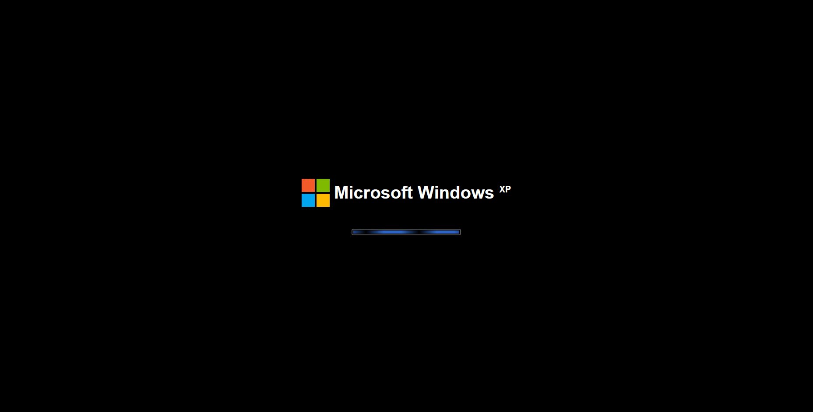

# Windows XP Portfolio 🖥️

A React-based interactive portfolio application that faithfully recreates the classic Windows XP operating system interface. This project brings back the nostalgia of the early 2000s, built using modern web technologies — and it's packed with **real personal data**, functioning apps, and an authentic OS experience.



> **[🚀 Live Demo](https://sandhanudulmeth.github.io/Sandhanu-Dulmeth-Mendis-portfolio/)**

---

## 🌟 Features

### 🖥️ OS Experience
* **Authentic Boot Sequence**: Simulates the Windows XP startup with an animated loading bar and Microsoft logo.
* **Interactive Login Screen**: Classic XP welcome screen — click the user to log in.
* **Classic Desktop Environment**: Familiar Bliss-like wallpaper, double-clickable desktop icons, and interactive Start Menu.
* **Taskbar & System Tray**: Displays open app tabs, Start button, volume/security icons, and a live clock.
* **Window Management**: Drag, cascade, maximize, minimize, and close windows with authentic XP title bar styling.
* **Start Menu**: Fully functional with left panel (apps) and right panel (My Documents → GitHub, Help & Support → usage tips, Search → GitHub profile).

### 📁 Built-in Applications
* **👤 About Me** — XP "System Properties" dialog with tabs (General / Skills / Interests). Shows bio, tech stack grouped by category, and current interests.
* **📝 My Resume** — PDF-viewer style resume displaying full CV: education at UCSC, production projects, technical skills, and contact info.
* **🎨 My Projects** — Windows Explorer "Details" view listing 18 real GitHub projects. Switch between Details and Icons views. Double-click to open GitHub repos.
* **📧 Contact Me** — Outlook Express compose window. Pre-filled "To" field, real email via `mailto:` link, and direct links to LinkedIn, GitHub, and Portfolio.
* **🌐 Internet Explorer** — Simulated GitHub profile page with dark theme, pinned repos (clickable), and a mock contribution graph.
* **🗑️ Recycle Bin** — An empty bin, just like the real thing.

---

## 🛠️ Tech Stack & Architecture

* **Frontend Library**: [React 19](https://react.dev/)
* **Build Tool**: [Vite](https://vitejs.dev/) (Fast HMR & build bundling)
* **State Management**: React Context API (`OSContext.jsx`) managing window states, focus, z-index, and system boot/login phases.
* **Styling**: Vanilla CSS with CSS custom properties defined in `xp-theme.css` — matching the exact Windows XP Luna theme.
* **Testing Suite**: [Vitest](https://vitest.dev/) & React Testing Library
* **Deployment**: [GitHub Pages](https://pages.github.com/) via `gh-pages`

---

## 🚀 Getting Started

### Prerequisites

Make sure you have Node.js installed on your system.

### Installation

1. **Clone the repository**:
   ```bash
   git clone https://github.com/sandhanudulmeth/Sandhanu-Dulmeth-Mendis-portfolio.git
   cd Sandhanu-Dulmeth-Mendis-portfolio
   ```

2. **Install dependencies**:
   ```bash
   npm install
   ```

### Running Locally

To run the development server:
```bash
npm run dev
```
Open your browser and navigate to the local URL (usually `http://localhost:5173`).

### Testing

Run the automated test suite:
```bash
npm run test
```

### Production Build & Deployment

* **Build the project**:
  ```bash
  npm run build
  ```
* **Preview the production build**:
  ```bash
  npm run preview
  ```
* **Deploy to GitHub Pages**:
  ```bash
  npm run deploy
  ```

---

## 📁 Project Structure

```text
├── public/                 # Static assets (favicon, UI screenshot)
├── src/
│   ├── components/
│   │   ├── Apps/           # Portfolio apps
│   │   │   ├── AboutMe.jsx        # XP System Properties with tabs
│   │   │   ├── Resume.jsx         # PDF-viewer style CV
│   │   │   ├── Projects.jsx       # Windows Explorer with 18 real projects
│   │   │   ├── Contact.jsx        # Outlook Express compose window
│   │   │   └── InternetExplorer.jsx  # GitHub profile page simulation
│   │   └── OS/             # Core OS components
│   │       ├── BootScreen.jsx     # XP boot animation
│   │       ├── LoginScreen.jsx    # XP welcome screen
│   │       ├── Desktop.jsx        # Desktop with icons & wallpaper
│   │       ├── Taskbar.jsx        # Taskbar with Start button & tray
│   │       ├── Window.jsx         # Draggable window manager
│   │       └── StartMenu.jsx      # Full XP Start Menu
│   ├── context/
│   │   └── OSContext.jsx   # Global OS state (boot → login → desktop)
│   ├── styles/
│   │   └── xp-theme.css    # Windows XP Luna theme variables
│   ├── App.jsx             # Root OS state manager
│   └── main.jsx            # Entry point
├── eslint.config.js        # ESLint configuration
└── vite.config.js          # Vite build config
```

---

## 📄 License

This project is open-source and licensed under the [GNU General Public License v3.0](./LICENSE).
